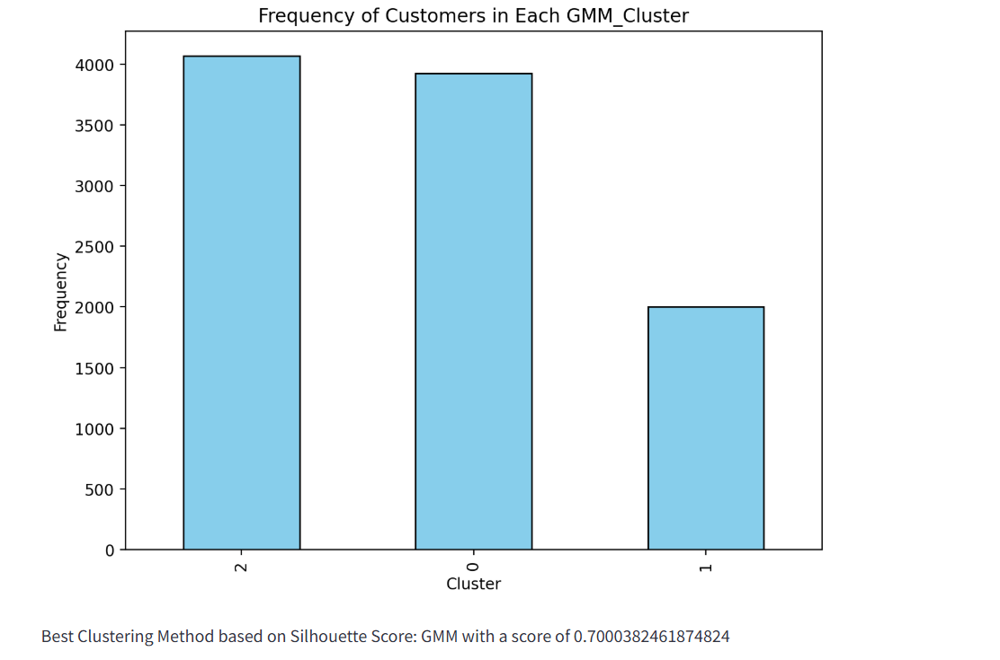

# 🎬 Cinema Retail Customer Segmentation

This project focuses on clustering cinema customers based on their behavioral patterns. It includes an interactive Streamlit app for real-time analysis and helps identify customer groups to enhance marketing strategies.

---

## 🔧 Tools & Technologies Used
- **Languages:** Python  
- **Libraries & Frameworks:** Pandas, NumPy, Matplotlib, Seaborn, Scikit-learn, Plotly, Streamlit  
- **Clustering Models:** K-Means, Hierarchical Clustering,Agglomerative Clustering , Gaussian Mixture Model (GMM)
- **Tools:** Spyder

---

## 📊 Project Highlights
- ✅ Clustered **10,000+ cinema customer records**
- ✅ Implemented **K-Means**,  **Hierarchical Clustering** , **Agglomerative Clustering**,and **GMM**
- ✅ Built an **interactive Streamlit dashboard** for cluster insights
- ✅ Improved targeted marketing and customer segmentation strategies

---

## 🖼️ Visualizations

### 🔹 Cluster Plots (19 Images)

<details>
<summary>Click to expand cluster visualizations</summary>

  
  
  
  
  
  
  
  
  
  
  
  
  
  
  
  
  
  


</details>

---

### 🔹 Streamlit App Screens (10 Images Excluding Home Page)

<details>
<summary>Click to expand Streamlit UI screenshots</summary>

  
  
  
  
  
  
  
  
  



</details>

---

## 🚀 How to Run This Project

### 1️⃣ Clone the Repository
```bash
git clone https://github.com/your-username/Cinema_Retail_Clustering.git
